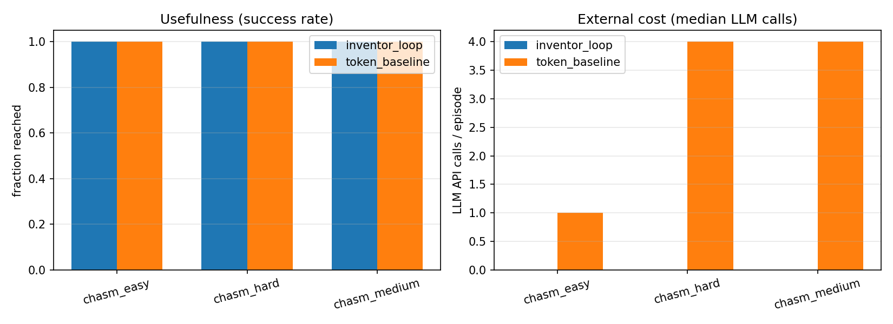

# Grounded Machine Invention

Companion code for the research paper *Grounded Machine Invention: Toward Pre-Linguistic Creative Intelligence Through Embodied World Models*.

The repo holds a small physics sandbox used to compare two ways of inventing a solution to the same task: iterating in language (an LLM that proposes plank placements as JSON) versus iterating in a grounded latent space (internal simulation with language only at the end, if at all).

**Repository:** https://github.com/codeBunny2022/grounded-machine-invention

## What this is testing

The paper argues that useful invention may require agents to simulate and refine ideas inside a world model *before* projecting them into tokens. This codebase is the smallest experiment we could build to make that claim concrete.

Two agents play the same game:

| | Token baseline | Inventor Loop |
|---|---|---|
| Where iteration happens | LLM prompts | Continuous latent vector |
| Physics feedback | After each API call | After each internal sim |
| External LLM calls per episode | 1 per attempt (median 4) | 0 during search |

Both agents share the decoder, simulator, plank budget, and fitness function. The only deliberate difference is the iteration substrate.

## The task

*Cross the Chasm* is a 2D pymunk scene. A ball starts on a left platform and must reach a right platform across a gap. The agent places rigid planks (position, length, angle). Three curriculum rungs increase the gap width and plank budget: `chasm_easy`, `chasm_medium`, `chasm_hard`.

## Results

Offline run with the bundled mock LLM proposer (`--episodes 8 --seed 0`). Raw numbers live in [`inventor-loop/results/main.json`](inventor-loop/results/main.json).

| Metric | Token baseline | Inventor Loop |
|---|---|---|
| Success rate (5 attempts) | 1.00 | 1.00 |
| Success rate (1 LLM call only) | 0.33 | 1.00 |
| Originality (latent diversity) | 1.53 | 2.97 |
| Surprise | 0.00 | 0.00 |
| Median LLM calls / episode | 4 | 0 |
| Median internal sims / episode | — | 180 |
| Cascade rate on `chasm_hard` | — | 0.00 |



A few notes on how to read this:

- With enough LLM retries, the token baseline eventually bridges every rung. The interesting gap opens when you cap external calls: one call leaves it at 33% success while the Inventor Loop still solves the task.
- Originality is higher for the Inventor Loop because it samples different bridge layouts in latent space rather than repeating one placement pattern.
- Surprise and cascade are flat here. The PoC uses the simulator as its world model (so surprise is near zero by design), and the grounded generator already solves each rung without help from memory.

## Quick start

```bash
cd inventor-loop
python3 -m venv .venv && source .venv/bin/activate
pip install -r requirements.txt
python -m pytest
python scripts/run_comparison.py --agents token,inventor --episodes 8 --seed 0
```

No API key is required for the default configuration (`LLM_PROVIDER=mock` in `.env.example`). Set `LLM_PROVIDER=openai` if you want a real model behind the token baseline.

## Layout

```
inventor-loop/
  inventor/          agents, physics world, metrics, LLM wrapper
  scripts/           run_comparison.py
  tests/             pytest smoke tests
  results/           recorded experiment JSON
  figures/           comparison plot from the main run
```

See [`inventor-loop/README.md`](inventor-loop/README.md) for module-level detail and metric definitions.

## Research paper

The paper develops the full Grounded Machine Invention (GMI) framework: grounded world models, active inference, persistent memory, execution grounding, and the Inventor Loop architecture. Section 6 maps directly onto this repository.

The LaTeX source and PDF are kept locally with the paper draft and are not part of this git repository.

## Citation

If you use this code, please cite:

```bibtex
@software{chauhan2026inventorloop,
  author = {Chirag Chauhan},
  title = {Grounded Machine Invention — Inventor Loop},
  year = {2026},
  url = {https://github.com/codeBunny2022/grounded-machine-invention},
  version = {v0.1.0}
}
```

For the research paper:

```bibtex
@article{chauhan2026gmi,
  author = {Chirag Chauhan},
  title = {Grounded Machine Invention: Toward Pre-Linguistic Creative Intelligence Through Embodied World Models},
  year = {2026},
  note = {Preprint}
}
```

Licensed under [MIT](LICENSE).
